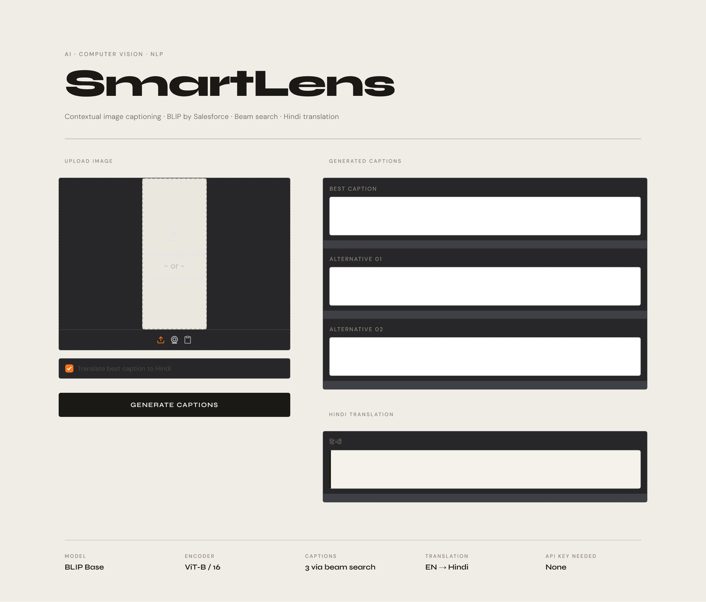
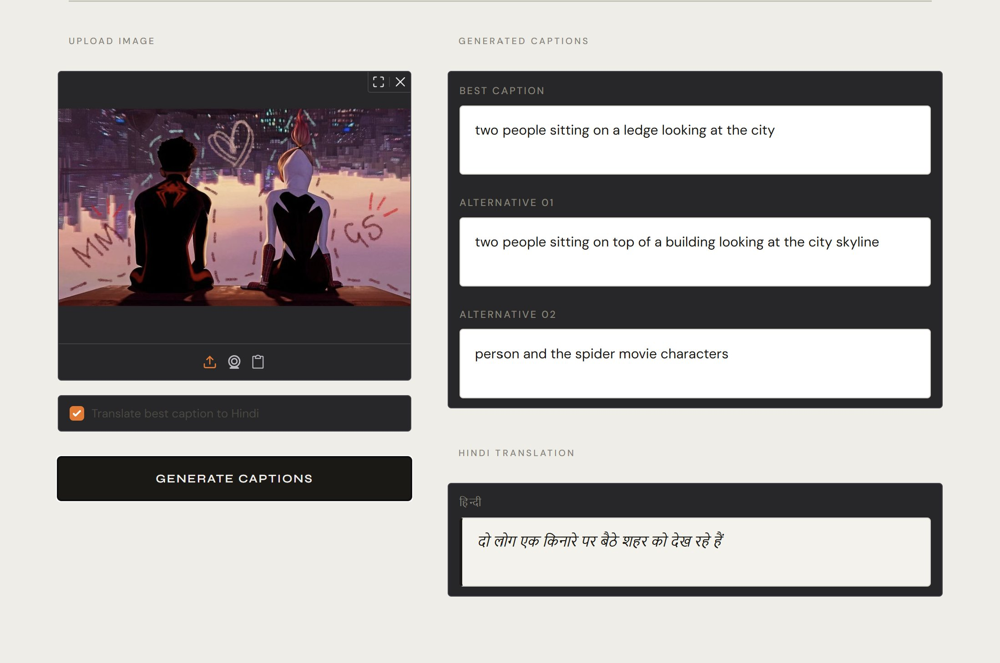
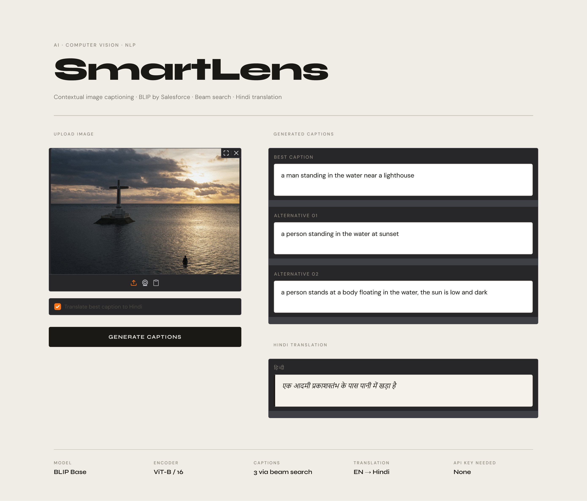

# 🔍 SmartLens — Contextual Image Caption Generator

> Generate rich, diverse captions for any image — with multilingual support and BLEU evaluation. Runs fully offline. No API key needed.


---

## ✨ Features

| Feature | Description |
|---|---|
| 🧠 **BLIP Model** | State-of-the-art vision-language model by Salesforce |
| 🖼️ **3 Diverse Captions** | Greedy + beam search + temperature sampling |
| 🌐 **Hindi Translation** | Translates best caption to Hindi (free, no API) |
| 📊 **BLEU Evaluation** | Quantitative caption quality scoring |
| 🎛️ **Gradio Web UI** | Clean, editorial interface — launch with one command |
| ⚡ **No Dataset Needed** | Fully pretrained — works on any image immediately |

---

## 🖥️ Interface

> Clean editorial UI — upload any image and get 3 captions instantly.



---

## 📸 Demo

### Example 1 — Animated / Illustrated Image

| Input Image | Output |
|---|---|
|  |  |

**Generated captions:**
- **Best:** `two people sitting on a ledge looking at the city`
- **Alt 01:** `two people sitting on top of a building looking at the city skyline`
- **Alt 02:** `person and the spider movie characters`
- **Hindi:** `दो लोग एक किनारे पर बैठे शहर को देख रहे हैं`

---

### Example 2 — Real Photography

| Input Image | Output |
|---|---|
|  |  |

**Generated captions:**
- **Best:** `a man standing in the water near a lighthouse`
- **Alt 01:** `a person standing in the water at sunset`
- **Alt 02:** `a person stands at a body floating in the water, the sun is low and dark`
- **Hindi:** `एक आदमी प्रकाशस्तंभ के पास पानी में खड़ा है`

---

## 🚀 Quick Start

### 1. Clone the repository
```bash
git clone https://github.com/YOUR_USERNAME/SmartLens.git
cd SmartLens
```

### 2. Install dependencies
```bash
pip install -r requirements.txt
```

### 3a. Run the Web App
```bash
python app.py
```
Then open **http://localhost:7860** in your browser.

### 3b. Run the Notebook
```bash
jupyter notebook SmartLens_Notebook.ipynb
```

---

## 🏗️ Architecture

```
Input Image
     │
     ▼
┌─────────────────────────────┐
│  BLIP Vision Encoder        │  ← ViT-B/16 (Vision Transformer)
│  (Image → Feature vectors)  │
└─────────────┬───────────────┘
              │
              ▼
┌─────────────────────────────┐
│  BLIP Language Decoder      │  ← GPT-style transformer
│  (Features → Caption text)  │
└─────────────┬───────────────┘
              │
     ┌────────┴──────────────┐
     ▼                       ▼
Greedy Caption       Beam Search + Sampling
(Best / most         (2 alternative captions)
 confident)
     │
     ▼
Hindi Translation (deep-translator)
     │
     ▼
BLEU Score (vs. reference caption)
```

---

## 📂 Project Structure

```
SmartLens/
├── app.py                    # Gradio web application
├── caption_engine.py         # Core model loading + inference
├── SmartLens_Notebook.ipynb  # Full walkthrough notebook
├── requirements.txt
├── assets/                   # Screenshots and demo images
└── README.md
```

---

## 🧠 Model Details

**BLIP** (Bootstrapping Language-Image Pre-training) is a vision-language model developed by Salesforce Research. It uses:
- A **Vision Transformer (ViT)** as the image encoder
- A **causal language model** as the text decoder
- Pre-trained on 129M image-text pairs from the web

Reference: [BLIP: Bootstrapping Language-Image Pre-training (ICML 2022)](https://arxiv.org/abs/2201.12086)

---

## 🔧 Tech Stack

- `transformers` — BLIP model from HuggingFace
- `torch` — PyTorch for inference
- `gradio` — Interactive web UI
- `deep-translator` — Free Hindi translation
- `nltk` — BLEU score computation
- `Pillow` — Image preprocessing

---

## 📄 License

MIT License — free to use, modify, and distribute.
